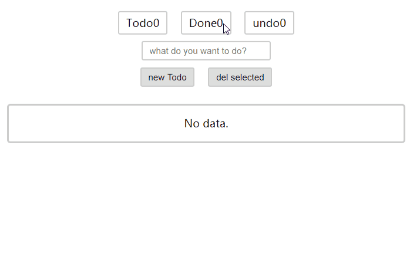

## React-Mobx-demo -- Use mobx in create-reacy-app.

### To Support Decorators.

Install `babel-plugin-transform-decorators-legacy": "^1.3.5` .  
Add `require.resolve('babel-plugin-transform-decorators-legacy')` to plugins in `.\node_modules\babel-preset-react-app\create.js` .
